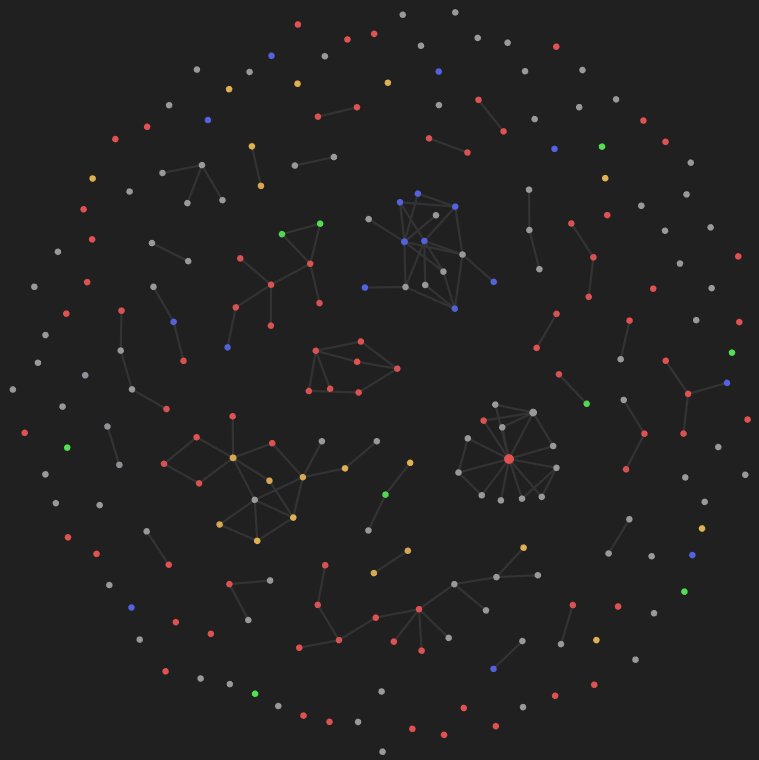

Zettelkasten is a **note taking process and a personal knowledge management** system rolled into one. It is spreading like wildfire in tech and academic circles. I promise it will supercharge your learning process.

Zettelkasten works as an external support system for your thinking process. The **main point of Zettelkasten is not better notes - its better thinking. Some type of externalization improves your thinking** greatly - be it paper and pen, mind-maps, text editor, anything - as long as it's outside your brain. Unlike other note taking systems, the Zettelkasten process forces you to actually think while creating notes - this will let you better understand and remember the concepts that you learn.

## Why Zettelkasten?

If you start using Zettelkasten, you'll notice these advantages...

-   Improved understanding of the concepts
-   Better retention and recall
-   You'll find links between concepts that were not apparent before
-   Intentionality - you'll be more focused when learning because you have to think and make notes
-   You have one place to store all your notes - not spread across multiple platforms

As we go into the Zettelkasten process, I'll explain how the process gives you each of these advantages.

## The Zettelkasten Process

The Zettelkasten process has three types of notes...

-   Fleeting Notes
-   Literature Notes
-   Permanent Notes

![[overview.png]]

### Fleeting Notes

Fleeting Notes is what you quickly scribble when you are consuming any content that needs notes. **Fleeting notes are just memory reminders** - you can discard them once you have created other notes from them.

Example: If you were creating fleeting notes for this article so far, it might look like this:

```
Zettelkasten = note taking process + knowledge management system 
external support system for thinking
3 types of notes: fleeting, literature, permanent
```

### Literature Notes

When you are finished watching the video or reading the article, go back to your fleeting notes and clean it up. Expand things that needs more explanation, add the source, etc. When doing this, don't copy paste from the source - create the notes in your own words.

When learning, re-reading is useless for understanding - it only creates an illusion of understanding. **What helps understanding is a self test - trying to explain what you learned to someone else**. That will show all the gaps in your understanding. Taking notes in your own words is a simple way of doing it. This will show you how much you understood - and where the gaps are.

Once you are done, you'll have a **summary of the content you just consumed - this is the Literature Note**.

Example: Literature notes for this chapter so far, would look like this...

```
Zettelkasten is a Note taking process + Personal knowledge management System.
It functions as a external support system for your thinking - as real thinking only happens with some sort of externalization(notebooks, mindmaps, etc). It forces you to think and process the content when creating notes.
It has 3 types of notes...
- Fleeting notes: Temporary notes for remembering
- Literature Notes: Fleeting notes combined and cleanup. Will be a summary of the content.
- Permanent Notes
```

### Permanent Notes

Permanent notes are the most crucial part of Zettelkasten. Once you are done with the Literature Notes, go through it and **extract every idea/concept found in it into separate notes**. Make sure the Permanent Notes meet the following criteria...

-   Write only **one idea per note** but be as complete as possible. This forces you to think about the content and distill it down to its core ideas.
-   Write as if you are writing for somebody else.
-   Show the content **source**.
-   The note should be understood even if you don't know the context it was taken from. If you are looking at the note later, you will have forgotten the original context. The **note should stand by itself**.
-   Be precise, clear and brief.

Example: Permanent notes of this chapter would look like...

```
# Zettelkasten
- Note taking process  
- Personal knowledge management  
It functions as a external support system for your thinking - as real thinking only happens with some sort of externalization(notebooks, mindmaps, etc). It forces you to think and process the content when creating notes.
```

```
# 3 Types of Notes in Zettelkasten

[[Zettelkasten]] has 3 types of notes...  
- Fleeting notes: Temporary notes for remembering  
- Literature Notes: Fleeting notes combined and cleanup. Will be a summary of the content.  
- [[Permanent Notes]]
```

```
# Permanent Notes

Permanent Notes in [[Zettelkasten]] should follow this framework...  
- One idea per note - but as complete as possible in your own words  
- Write as if you are writing for someone else - use full sentences  
- Show sources  
- Be precise, clear and brief  
- Should be understood even if you don't know the context it was taken from
```

## Connections Between Notes

Once you have created the notes, think **how the newly created notes connect with your existing knowledge**. If you find some connections, connect the new notes with the older notes already in your system. Some lens you can use to find connections...

-   How does this idea fit into what I already know?
-   What does this idea mean for some other idea that I already have?
-   Does this add to, contradict, or explain another idea that I already have?

The method of creating a link between notes will be based on the tool you are using to create notes. The most common option used is the **\[\[WikiLink\]\] format**. Just put **two square brackets(`[[`** and **`]]`) around the name of the note** you want to link to. If you want to link to a note called 'Zettelkasten', the link will look like this - `[[Zettelkasten]]`.

One hidden benefit of making these connections is that it helps you to remember the content better. The Brain remembers things by connecting it to existing knowledge - this process gives the brain more hooks to connect the new knowledge to.



After a while, this will end up being an **interconnected web of ideas**. The image you see is a visual representation of my Zettelkasten system. You can see how the concepts link with each other. When you have used it for a while, you'll see new connections emerging between previously unconnected ideas. You'll find interesting insights this way.

Example...

To understand this better, let's look at an example. I recently encountered the concept of Impostor Syndrome. It's a psychological pattern in which somebody who knows a lot thinks that they know very little or not enough. This is how my Note would look like...

```
# Impostor Syndrome

This is a psychological pattern in which an individual doubts their skills, talents or accomplishments and has a persistent internalized fear of being exposed as a "fraud". Individuals with impostor syndrome incorrectly attribute their success to luck, or interpret it as a result of deceiving others into thinking they are more intelligent than they perceive themselves to be.
```

A few days later, I come across another concept called Dunning-Kruger Effect, where somebody who actually knows only a little thinks that they know a lot. Almost an exact opposite of Impostor Syndrome. So when I take down the new Note about Dunning-Kruger Effect, I will link out to my earlier Impostor Syndrome Note.

```
# Dunning–Kruger Effect

Dunning–Kruger effect is a cognitive bias in which people with low ability at a task overestimate their ability.

People who don't know much think of themselves as experts. This is the opposite of [[Imposter Syndrome]]
```

## Practice

Creating permanent notes acts as a self test - because you are putting the content in your own words. This will help you understand what you have learnt. There is another way to hammer in what you learnt - **deliberate practice**. Deliberate practice is not a part of Zettelkasten - but it is a part of this tutorial. If you want to understand this process better, the best way to do it is to make notes about this chapter in the Zettelkasten format.

### Tasks

-   Go to the beginning of this chapter.
-   Write down the notes on this tutorial in the Zettelkasten format.

---

Once you have set up your Zettelkasten system, the next step is to **create your first 50 notes**. At that point, you'll start seeing the benefits of the system.