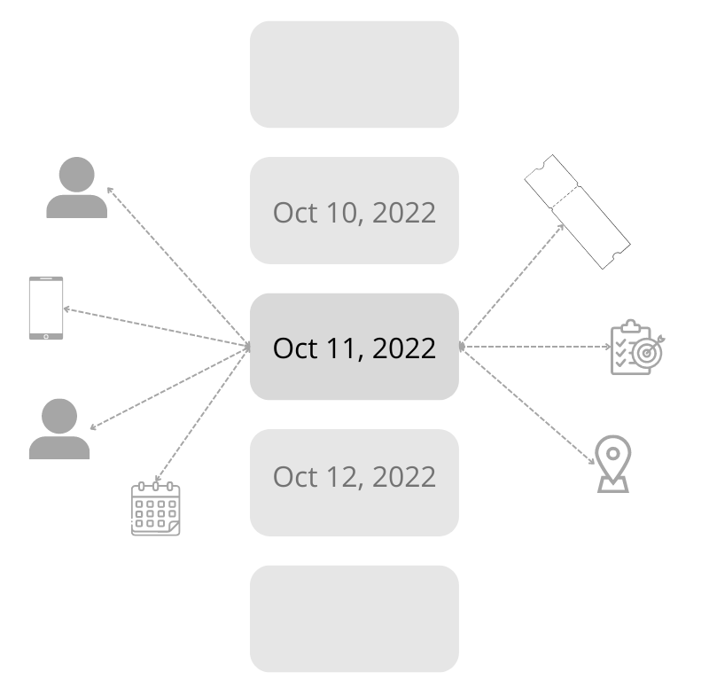

Ever since I have learned about PKM couple of years ago, I have been experimenting with it. I(and many others) have noticed that PKM tools and process will supercharge Journaling. If you use the principles of PKM when writing journals you'll get an inter-linked journal that will give you a much greater visibility over your life. You'll be able to find more useful information about your life much more easily. I call this Graph Journal.

## Why Graph Journal

What you have visibility over, you can manage better. Better visibility almost always gives you better malleability. Suddenly you are seeing patterns you never saw before. You see that whenever you meet this one friend, you feel happy. But when you go to one place, you get angry. You start seeing connections about your life that can only be seen if you can look at it from a distance. That is what the graph journaling approach will give you. A birds eye view of your life.

When journaling in this format, you are naming and making visible various parts of your life. This could be...

- Life events - Eg. 2022 Europe Trip, Graduation, Last therapy session, etc.
- Days, Weeks, Months, Years - Eg. 2020, 2020 March
- Projects that you work on  
- Aspects of Life
	- Relations
	- Work
	- Hobbies
	- And many more.
- People you interact with  
- Things you interact with  
	- Home  
	- Computer
	- Phone  
	- Etc
- Interactions between these points.

Graph Journal promises a different view of your life. A view where all parts of your life can be seen as data points. Each data point can be manipulated, linked, elaborated on, connected to other data points. After a while of doing this, you will start to view your life in a new light. You will see connections that were hidden before. Patterns that could be useful. 

The first step towards understanding something is to see it better. To see it as a whole - and not just the parts. And this is what graph journal lets you do.

## The Process

To do Graph journaling, you need two things...

- PKM Tools - Software that is used for PKM: Obsidian, Logseq, etc.
- PKM Systems - Processes or methods that are used in PMK: Backlinks/WikiLinks, Tags, etc.

You'll have to do the journaling in one of the existing PKM tools. It has great support for the systems we'll be using to create the graph journal. I use Logseq, but another highly recommended tool is Obsidian. Any PKM tool with journal/daily note feature should do the trick.

When writing a journal entry, follow this process.

- Every time you use an idea(usually the noun/subject) in your journal that you are sure you'll refer to again, link it using `[[WikiLinks]]`.
- When you write about something that you want to track, link it in the same format.

Example...

> `I met [[John]]. I was really [[excited]] to meet him after so long.`

In this example, I'm tracking `John` and `excited`. 

After 2-3 weeks of journaling in this format, check out the graphs that you have created. You'll see new pattern. Some element that is linked way more often that you would have thought. I guarantee there will be some surprises waiting for you in that graph. Surprises are new information that you should investigate. It tells you where your worldview was wrong.

## The Vision

Think of all the days you journal as a spine.

Each journal entry is a vertebrae in this spine.

Each journal connects to multiple other things. It might be people you interacted with. It might be places you went to, things that you used, feelings you had.

After enough such vertebrae, you can see a structure emerging. An interconnected graph of your life and all the aspects surrounding it. If you have enough such entries, this graph will start telling you a story - a story that you might not be aware of.

That is one of the major goals of this type of journaling. Giving you visibility about your life that you didn't know was possible.
